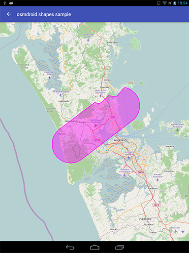
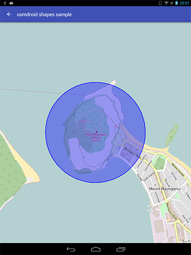
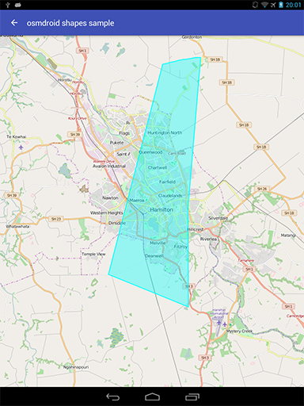
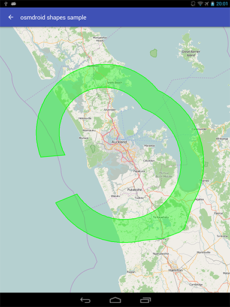
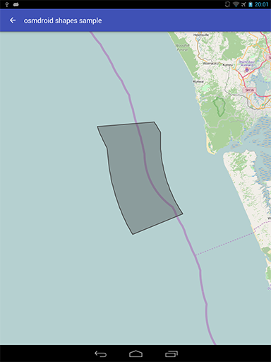

#osmdroid-extensions 

Complex polygons on osmdroid map control.

### 1. Complex shapes on osmdroid map control.

<pre><code>    </code></pre>

##### Under the hood:

[ShapeAsPointsBuilder.java](osmdroid-shape-extension-lib/src/main/java/com/github/lassana/osmdroid_shape_extension/ShapeAsPointsBuilder.java).

##### Usage:

    final ShapeAsPointsBuilder shapeBuilder = new ShapeAsPointsBuilder()
            .GRC(new GeoPoint(-36.76736, 174.83433))
            .CWA(new GeoPoint(-36.93842, 174.55269), new GeoPoint(-36.87200, 174.48986), new GeoPoint(-36.80550, 174.42714))
            .CCA(new GeoPoint(-36.68503, 174.62581), new GeoPoint(-36.66514, 174.64464), new GeoPoint(-36.68342, 174.66586))
            .CCA(new GeoPoint(-36.66372, 174.69231), new GeoPoint(-36.64542, 174.67103), new GeoPoint(-36.65486, 174.69992))
            .GRC(new GeoPoint(-36.66072, 174.74381))
            .CWA(new GeoPoint(-36.61911, 174.79094), new GeoPoint(-36.70106, 174.77139), new GeoPoint(-36.76736, 174.83433));

    final Polygon polygon = new Polygon(context);
    polygon.setPoints(shapeBuilder.toList());
    polygon.setFillColor(0x60FF00FF);
    polygon.setStrokeColor(Color.MAGENTA);
    polygon.setStrokeWidth(1f);

    map.getOverlays().add(polygon);
    map.invalidate();

### 2. Drawing a bitmap (e.g. a grid) inside OSMBonusPack Polygon.

##### Implementation:

[BitmapPolygon.java](osmdroid-shape-extension-lib/src/main/java/com/github/lassana/osmdroid_shape_extension/BitmapPolygon.java).

##### Usage:

    final BitmapPolygon polygon = new BitmapPolygon(context);
    polygon.setPoints(geoData);
    polygon.setFillColor(fillColor);
    polygon.setStrokeColor(strokeColor);
    polygon.setStrokeWidth(strokeWidth);
    polygon.setPatternBitmap(BitmapFactory.decodeResource(getResources(), R.drawable.pattern));
    
    map.getOverlays().add(polygon);
    map.invalidate();

### License

[The FreeBSD license](LICENSE).
