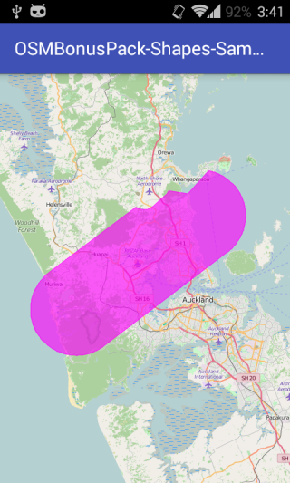
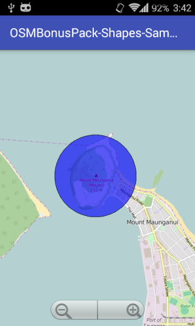

# osmdroid-shape-extention
Complex shapes on osmdroid map control.

 

## Usage:

    final Polygon polygon = new Polygon(this);
    final ShapeAsPointsBuilder shapeBuilder = new ShapeAsPointsBuilder();

    // I filled the data manually, but it can be done more clever, of course.
    shapeBuilder.GRC(new GeoPoint(-36.76736, 174.83433));
    shapeBuilder.CWA(new GeoPoint(-36.93842, 174.55269),
                        new GeoPoint(-36.87200, 174.48986),
                        new GeoPoint(-36.80550, 174.42714),
                        0.08333d);
    shapeBuilder.CCA(new GeoPoint(-36.68503, 174.62581),
                        new GeoPoint(-36.66514, 174.64464),
                        new GeoPoint(-36.68342, 174.66586),
                        0.02500d);
    shapeBuilder.CCA(new GeoPoint(-36.66372, 174.69231),
                        new GeoPoint(-36.64542, 174.67103),
                        new GeoPoint(-36.65486, 174.69992),
                        0.02500d);
    shapeBuilder.GRC(new GeoPoint(-36.66072, 174.74381));
    shapeBuilder.CWA(new GeoPoint(-36.61911, 174.79094),
                        new GeoPoint(-36.70106, 174.77139),
                        new GeoPoint(-36.76736, 174.83433), //close shape going to the start point
                        0.08333d);

    polygon.setPoints(shapeBuilder.toList());
    polygon.setFillColor(0xA0FF00FF);
    polygon.setStrokeColor(Color.MAGENTA);
    polygon.setStrokeWidth(1f);
    map.getOverlays().add(polygon);
    map.invalidate();
    
##License

[LGPLv3](LICENSE).
